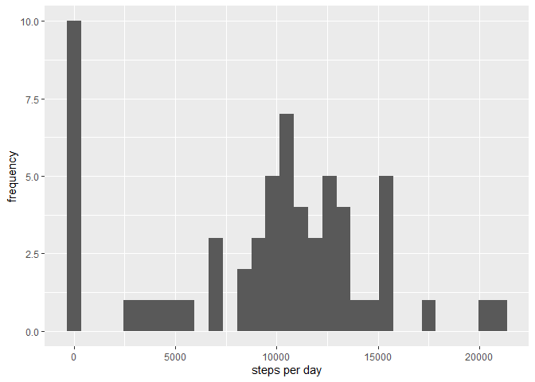
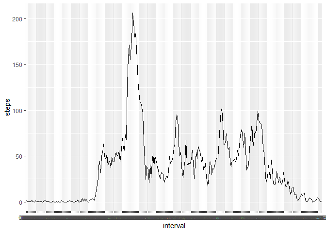

# Reproducible Research: Peer Assessment 1

## Introduction

It is now possible to collect a large amount of data about personal
movement using activity monitoring devices such as a Fitbit, Nike
Fuelband, or Jawbone Up. These type of devices are part of the
“quantified self” movement - a group of enthusiasts who take
measurements about themselves regularly to improve their health, to find
patterns in their behavior, or because they are tech geeks. But these
data remain under-utilized both because the raw data are hard to obtain
and there is a lack of statistical methods and software for processing
and interpreting the data.

This assignment makes use of data from a personal activity monitoring
device. This device collects data at 5 minute intervals through out the
day. The data consists of two months of data from an anonymous
individual collected during the months of October and November, 2012 and
include the number of steps taken in 5 minute intervals each day.

## Data

The data for this assignment can be downloaded from the course web site:

-   Dataset: Activity monitoring data \[52K\]
    (<https://d396qusza40orc.cloudfront.net/repdata%2Fdata%2Factivity.zip>)

The variables included in this dataset are:

-   steps: Number of steps taking in a 5-minute interval (missing values
    are coded as NA)

-   date: The date on which the measurement was taken in YYYY-MM-DD
    format

-   interval: Identifier for the 5-minute interval in which measurement
    was taken

The dataset is stored in a comma-separated-value (CSV) file and there
are a total of 17,568 observations in this dataset.

## Assignment

Set to show R code.

``` r
library(knitr)
opts_chunk$set(echo=TRUE)
```

## Loading and preprocessing the data

``` r
library(ggplot2)
library(dplyr)
```

    ## Warning: package 'dplyr' was built under R version 4.0.4

**Load the data**

``` r
fileurl <- 'https://d396qusza40orc.cloudfront.net/repdata%2Fdata%2Factivity.zip'
if(!file.exists('activity.csv')) {
        download.file(fileurl, 'zipfile.zip', method='curl')
        unzip('zipfile.zip')
        file.remove('zipfile.zip')
}
activity <- read.csv('activity.csv')
```

**Process/transform the data (if necessary) into a format suitable for
your analysis**

``` r
activity <- read.csv('activity.csv')
str(activity)
```

    ## 'data.frame':    17568 obs. of  3 variables:
    ##  $ steps   : int  NA NA NA NA NA NA NA NA NA NA ...
    ##  $ date    : chr  "2012-10-01" "2012-10-01" "2012-10-01" "2012-10-01" ...
    ##  $ interval: int  0 5 10 15 20 25 30 35 40 45 ...

``` r
activity$date <- as.Date(activity$date, '%Y-%m-%d')
activity$interval <- sprintf("%04d", activity$interval)
activity$interval <- format(strptime(activity$interval, format="%H%M"), format = "%H:%M")
```

## What is mean total number of steps taken per day?

------------------------------------------------------------------------

**Calculate the total number of steps taken per day**

``` r
daysteps <- tapply(activity$steps, activity$date, sum, na.rm=T)
```

**Make a histogram of the total number of steps taken each day**

``` r
daysteps %>% qplot(xlab='steps per day', ylab='frequency', binwidth=700)
```



**Calculate and report the mean and median of the total number of steps
taken per day**

``` r
meanvalue <- mean(daysteps)
medianvalue <- median(daysteps)
```

Mean: 9354.2295082, Median:10395

## What is the average daily activity pattern?

------------------------------------------------------------------------

**Make a time series plot of the 5-minute interval (x-axis) and the
average number of steps taken, averaged across all days (y-axis)**

``` r
average_steps <- activity %>% filter(!is.na(steps)) %>% group_by(interval) %>% 
        summarize(steps = mean(steps))
average_steps %>% ggplot(aes(x=interval, y=steps, group=1)) + geom_line()
```



**Which 5-minute interval, on average across all the days in the
dataset, contains the maximum number of steps?**

``` r
max_steps <- average_steps[which.max(average_steps$steps), ][[1]]
```

The interval 08:35 has the maximum steps

## Imputing missing values

------------------------------------------------------------------------

**Calculate and report the total number of missing values in the
dataset**

``` r
miss <- sapply(activity, is.na) %>% sum
```

Number of missing values: 2304

**Devise a strategy for filling in all of the missing values in the
dataset. The strategy does not need to be sophisticated. For example,
you could use the mean/median for that day, or the mean for that
5-minute interval, etc.**

We’ll fill in the missing values with the `steps` mean

**Create a new dataset that is equal to the original dataset but with
the missing data filled in.**

``` r
steps_complete <- activity$steps
steps_complete[is.na(steps_complete)] <- round(mean(activity$steps, na.rm = T), digits=0)
steps_complete <- as.numeric(steps_complete)
activity_complete <- cbind.data.frame(steps_complete, activity$date, activity$interval)
colnames(activity_complete) <- colnames(activity)
```

**Make a histogram of the total number of steps taken each day**

``` r
daysteps_complete <- tapply(activity_complete$steps, activity_complete$date, sum)
daysteps_complete %>% qplot(xlab='steps per day', ylab='frequency')
```


**Calculate and report the mean and median total number of steps taken
per day. Do these values differ from the estimates from the first part
of the assignment? What is the impact of imputing missing data on the
estimates of the total daily number of steps?**

``` r
mean_complete <- mean(daysteps_complete)
median_complete <- median(daysteps_complete)
```

Mean: 1.0751738^{4}, Median: 1.0656^{4}

The mean and median values differ from those which were calculated with
`NAs`. The values became greater

## Are there differences in activity patterns between weekdays and weekends?

------------------------------------------------------------------------

**Create a new factor variable in the dataset with two levels -
“weekday” and “weekend” indicating whether a given date is a weekday or
weekend day.**

``` r
activity_complete$date <- as.Date(activity_complete$date)
weekd <-c('Monday', 'Tuesday', 'Wednesday', 'Thursday', 'Friday')
activity_complete$weekdayz <- factor((weekdays(activity_complete$date) %in% weekd),
                                     levels = c(FALSE, TRUE), labels = c('weekend', 'weekday'))
```

**Make a panel plot containing a time series plot of the 5-minute
interval (x-axis) and the average number of steps taken, averaged across
all weekday days or weekend days (y-axis).**

``` r
average_steps_complete <- activity_complete %>% group_by(interval, weekdayz) %>%
        summarise(steps = mean(steps))
```

    ## `summarise()` has grouped output by 'interval'. You can override using the `.groups` argument.

``` r
average_steps_complete %>% ggplot(aes(x=interval, y=steps, group=1)) +
        geom_line() + 
        facet_grid(weekdayz~.)
```


